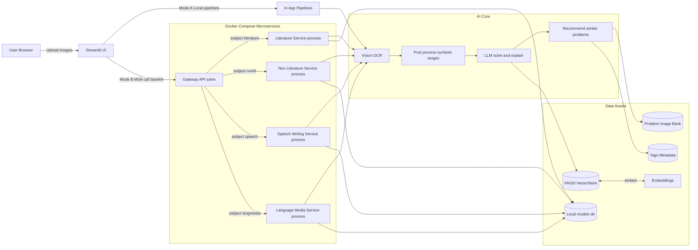

# KimHyeonJoo
김현주 포트폴리오 사이트

https://kkimhyeonjoo.github.io/KimHyeonJoo/




# 문학
```
flowchart TB
  IN[Input passage image and question image] --> QOCR[Question OCR]
  IN --> POCR[Passage OCR]

  POCR --> SPLIT[Split image OCR]
  SPLIT --> SYM[Restore symbols underline]
  SYM --> RANGE[Insert section markers A B]
  RANGE --> PTXT[Clean passage text]

  QOCR --> QTXT[Question text]
  PTXT --> CLASS[Classify query concept or problem]
  QTXT --> CLASS

  CLASS -->|problem| RET[Retriever MMR]
  RET --> VDB[(FAISS)]
  VDB --> REF[Reference context]
  REF --> GEN[LLM answer and explanation]

  CLASS -->|concept| GEN2[LLM concept answer]

  GEN --> TAG[Generate tags JSON]
  TAG --> HYB[Hybrid scoring tags and embeddings]
  HYB --> OUT[Output answer and similar problems topK]

```
