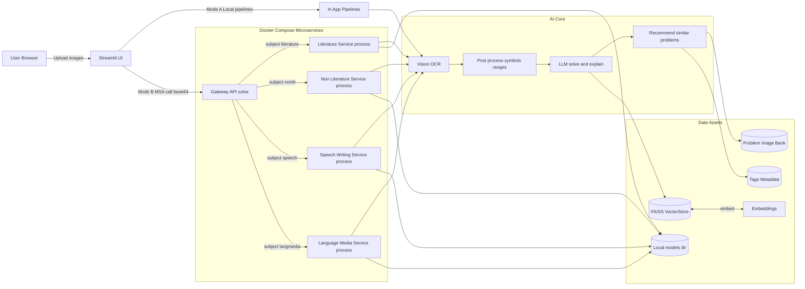
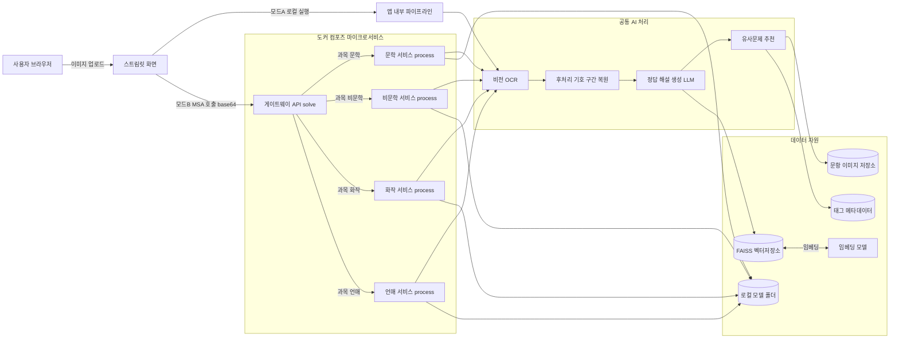
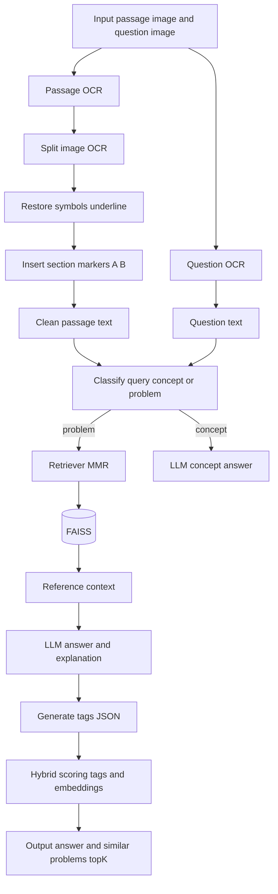
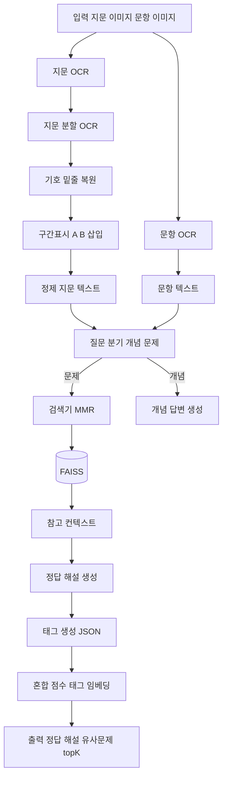

# KimHyeonJoo
김현주 포트폴리오 사이트

https://kkimhyeonjoo.github.io/KimHyeonJoo/

```mermaid
flowchart LR
  U[User Browser] -->|Upload images| FE[Streamlit UI]

  FE -->|Mode A Local pipelines| MONO[In App Pipelines]
  FE -->|Mode B MSA call base64| GW[Gateway API solve]

  subgraph MSA[Docker Compose Microservices]
    GW -->|subject literature| LIT[Literature Service process]
    GW -->|subject nonlit| NON[Non Literature Service process]
    GW -->|subject speech| SPC[Speech Writing Service process]
    GW -->|subject langmedia| LAM[Language Media Service process]
  end

  subgraph AI[AI Core]
    OCR[Vision OCR] --> POST[Post process symbols ranges]
    POST --> SOLVE[LLM solve and explain]
    SOLVE --> REC[Recommend similar problems]
  end

  subgraph DATA[Data Assets]
    VDB[(FAISS VectorStore)]
    EMB[Embeddings]
    BANK[(Problem Image Bank)]
    META[(Tags Metadata)]
    MODELS[(Local models dir)]
  end

  MONO --> OCR
  LIT --> OCR
  NON --> OCR
  SPC --> OCR
  LAM --> OCR

  SOLVE --> VDB
  VDB <-->|embed| EMB
  REC --> BANK
  REC --> META

  LIT --> MODELS
  NON --> MODELS
  SPC --> MODELS
  LAM --> MODELS

```

```mermaid

flowchart LR
  U[사용자 브라우저] -->|이미지 업로드| FE[스트림릿 화면]

  FE -->|모드A 로컬 실행| MONO[앱 내부 파이프라인]
  FE -->|모드B MSA 호출 base64| GW[게이트웨이 API solve]

  subgraph MSA[도커 컴포즈 마이크로서비스]
    GW -->|과목 문학| LIT[문학 서비스 process]
    GW -->|과목 비문학| NON[비문학 서비스 process]
    GW -->|과목 화작| SPC[화작 서비스 process]
    GW -->|과목 언매| LAM[언매 서비스 process]
  end

  subgraph AI[공통 AI 처리]
    OCR[비전 OCR] --> POST[후처리 기호 구간 복원]
    POST --> SOLVE[정답 해설 생성 LLM]
    SOLVE --> REC[유사문제 추천]
  end

  subgraph DATA[데이터 자원]
    VDB[(FAISS 벡터저장소)]
    EMB[임베딩 모델]
    BANK[(문항 이미지 저장소)]
    META[(태그 메타데이터)]
    MODELS[(로컬 모델 폴더)]
  end

  MONO --> OCR
  LIT --> OCR
  NON --> OCR
  SPC --> OCR
  LAM --> OCR

  SOLVE --> VDB
  VDB <-->|임베딩| EMB
  REC --> BANK
  REC --> META

  LIT --> MODELS
  NON --> MODELS
  SPC --> MODELS
  LAM --> MODELS
```

# 문학

```mermaid
flowchart TB
  IN[Input passage image and question image] --> QOCR[Question OCR]
  IN --> POCR[Passage OCR]

  POCR --> SPLIT[Split image OCR]
  SPLIT --> SYM[Restore symbols underline]
  SYM --> RANGE[Insert section markers A B]
  RANGE --> PTXT[Clean passage text]

  QOCR --> QTXT[Question text]
  PTXT --> CLASS[Classify query concept or problem]
  QTXT --> CLASS

  CLASS -->|problem| RET[Retriever MMR]
  RET --> VDB[(FAISS)]
  VDB --> REF[Reference context]
  REF --> GEN[LLM answer and explanation]

  CLASS -->|concept| GEN2[LLM concept answer]

  GEN --> TAG[Generate tags JSON]
  TAG --> HYB[Hybrid scoring tags and embeddings]
  HYB --> OUT[Output answer and similar problems topK]

```

```mermaid
flowchart TB
  IN[입력 지문 이미지 문항 이미지] --> QOCR[문항 OCR]
  IN --> POCR[지문 OCR]

  POCR --> SPLIT[지문 분할 OCR]
  SPLIT --> SYM[기호 밑줄 복원]
  SYM --> RANGE[구간표시 A B 삽입]
  RANGE --> PTXT[정제 지문 텍스트]

  QOCR --> QTXT[문항 텍스트]
  PTXT --> CLASS[질문 분기 개념 문제]
  QTXT --> CLASS

  CLASS -->|문제| RET[검색기 MMR]
  RET --> VDB[(FAISS)]
  VDB --> REF[참고 컨텍스트]
  REF --> GEN[정답 해설 생성]

  CLASS -->|개념| GEN2[개념 답변 생성]

  GEN --> TAG[태그 생성 JSON]
  TAG --> HYB[혼합 점수 태그 임베딩]
  HYB --> OUT[출력 정답 해설 유사문제 topK]
```
